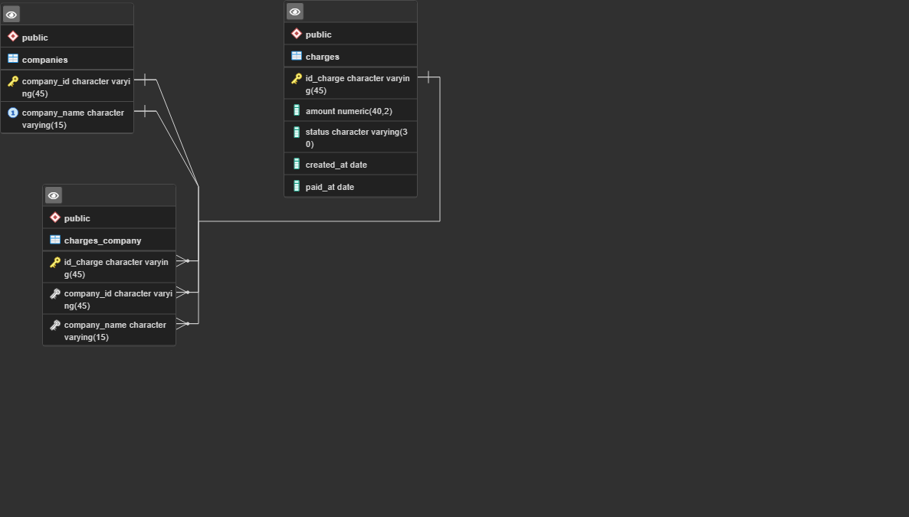

## Prueba técnica para la vacante de desarrollador Python JR.
\i C:/Users/Vivaldo/Documents/personal-projects/prueba-tecnica-nt/Seccion1/DB/Schema.sql

### Sección 1

Para esta primera parte comencé por inspeccionar el archivo proporcionado, notando que era un archivo delimitado por comas y con la particularidad de tener una línea en blanco o vacía entre cada renglón, la solución para esto fue definir una función que abriera el archivo y lo recorra por completo, en cada iteración se retorna un objeto iterable con las columnas del archivo csv, por lo que la longitud de ese objeto debía ser mayor a 0 para consider que no está vacía y no es una línea en blanco, esto independiente de si alguna columna tiene algún valor nullo.
Una vez que se tiene el archivo sin esta particularidad procedí a inspeccionar los datos que contiene notando que había valores nullos y otros en un formato diferente al de los demás, por ejemplo la columna *amount*, la cual sus valores en su gran mayoria son numeros pequeños con dos decimales después del punto, pero en algunos renglones esto cambió a tenerlos en una gran magnitud, por lo que posteriormente al momento de diseñar el esquema de la base de datos modifiqué el tipo de dato propuesto en la guía para que al momento de insertar los datos no existiera alguna incompatibilidad.

#### Extracción

En este apartado de igual forma me apoyé en Python para realizar esta tarea, creando una función que tomaba ciertos párametros de entrada y de esta manera extraer las columnas deseadas del archivo csv original, exportando la información y diviendola en partes mas pequeñas, teniendo un archivo individual para las tablas del esquema de la base de datos, en el formato de las mismas para realizar la importación de manera eficaz.

